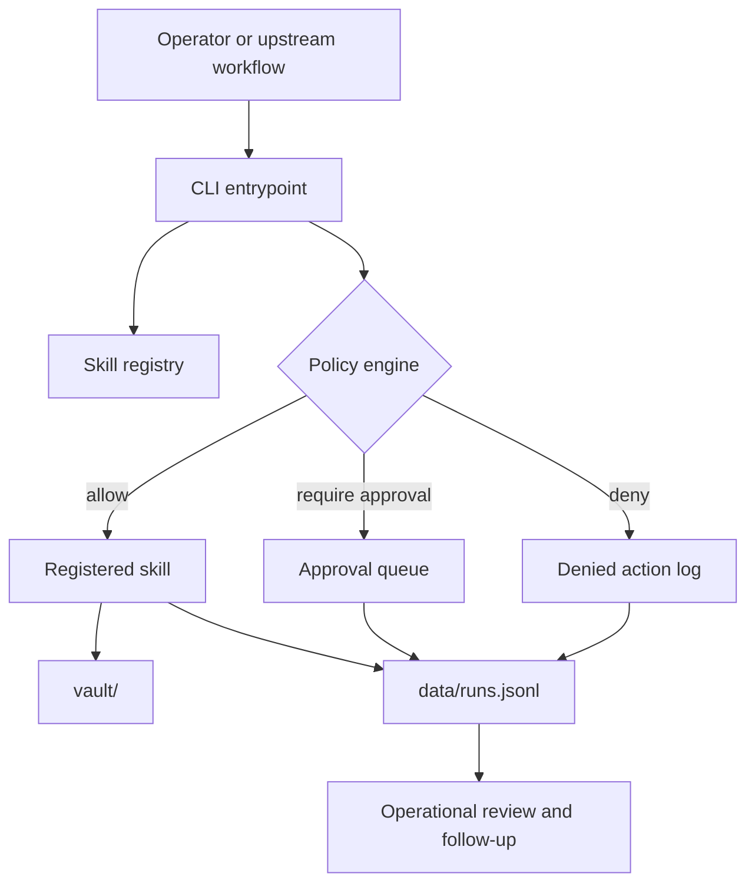

# agentic-os-control-plane

Governed workflow control plane for local-first operations.

This repository demonstrates a durable governance pattern for automated work:

- policy-based action control
- approval routing for high-risk operations
- append-only audit logging
- protected execution boundaries
- structured skill contracts
- operational handoff and vault management

It is intentionally company-neutral and platform-neutral. The focus is not a specific model vendor or one-off use case. The focus is how sensitive workflow automation is controlled, reviewed, and made auditable.

## What the repository demonstrates

`agentic-os-control-plane` models a governed execution layer that sits between operator intent and system side effects.

Core concerns covered in the current implementation:

- **Governed execution**: actions are classified as `ALLOW`, `REQUIRE_APPROVAL`, or `DENY`.
- **Approval routing**: sensitive actions generate structured approval records with lifecycle status.
- **Access control by path**: approved writes are constrained to `vault/` and `data/`.
- **Auditability**: every run writes an append-only JSONL record with inputs hashed rather than stored raw.
- **Exception handling**: denied actions, path violations, and failed executions are logged explicitly.
- **Operational visibility**: vault structure, approvals, and run history are inspectable on disk.
- **Business-facing governance**: skill contracts, policy tables, and lifecycle docs explain the control model in business terms.

## Operating model

```text
intake -> policy check -> execution -> vault write -> audit log -> handoff
```

## Architecture



## Repository layout

```text
agentic-os-control-plane/
├── src/agentic_os/
│   ├── cli.py
│   └── control_plane/
│       ├── approvals.py
│       ├── audit_log.py
│       ├── config.py
│       ├── policy.py
│       ├── registry.py
│       └── runner.py
├── skills/
│   └── <skill>/
│       ├── SKILL.md
│       └── run.py
├── vault/
│   ├── raw/
│   ├── wiki/
│   ├── projects/
│   └── daily/
├── data/
│   ├── approvals.jsonl
│   └── runs.jsonl
├── docs/
├── landing/
└── tests/
```

## Current skill set

The packaged runtime currently registers five skills:

- `morning_brief`
- `vault_cleanup`
- `research_digest`
- `continuation_brief`
- `policy_simulator`

Each skill is governed by a documented contract in `skills/<name>/SKILL.md` and is expected to write only to approved repository paths.

## Getting started

### 1. Install

```bash
chmod +x install.sh
./install.sh
```

### 2. List registered skills

```bash
agentic-os list
```

If you prefer the module form:

```bash
PYTHONPATH=src python -m agentic_os.cli list
```

### 3. Run a skill

```bash
agentic-os run morning_brief
agentic-os run research_digest --input vault/raw/sample_note.md
agentic-os run policy_simulator --input vault/raw/sample_action_manifest.json
```

### 4. Inspect approvals

```bash
agentic-os approvals list --status pending
```

## Policy summary

| Action | Decision |
| --- | --- |
| `FILE_READ` | `ALLOW` |
| `FILE_WRITE` to `vault/` or `data/` | `ALLOW` |
| `FILE_WRITE` to protected control surfaces | `DENY` |
| `FILE_DELETE` | `REQUIRE_APPROVAL` |
| `GIT_COMMIT`, `GIT_PUSH` | `REQUIRE_APPROVAL` |
| `EMAIL_SEND`, `API_WRITE`, `SHELL_EXEC` | `REQUIRE_APPROVAL` |

## Why this is useful

This repository is designed to show how workflow automation can be made operationally credible:

- the control model is explicit
- exception paths are first-class
- high-risk actions are routed instead of hidden
- audit history is durable and inspectable
- outputs are bounded to governed locations

## Known repository note

The supported runtime surface is the packaged implementation under `src/agentic_os/`. Historical root-level wrappers remain in the repository, but the packaged CLI is the maintained interface documented here.

## Documentation

- [docs/getting-started.md](docs/getting-started.md)
- [docs/architecture.md](docs/architecture.md)
- [docs/security-model.md](docs/security-model.md)
- [docs/how-to-write-a-skill.md](docs/how-to-write-a-skill.md)
- [docs/roadmap.md](docs/roadmap.md)

## License

MIT. See [LICENSE](LICENSE).
