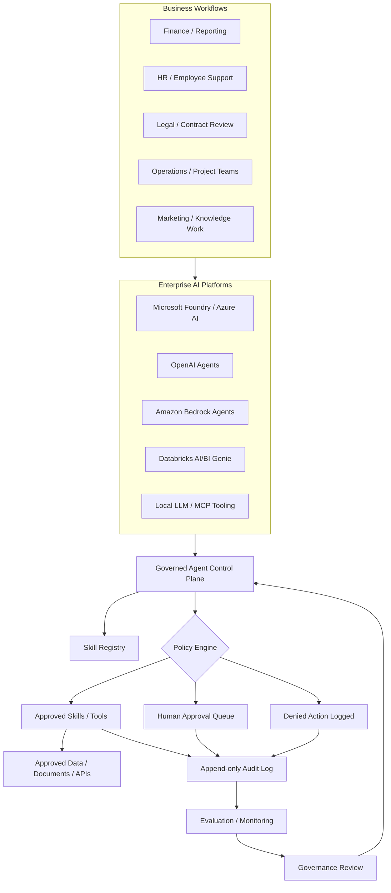
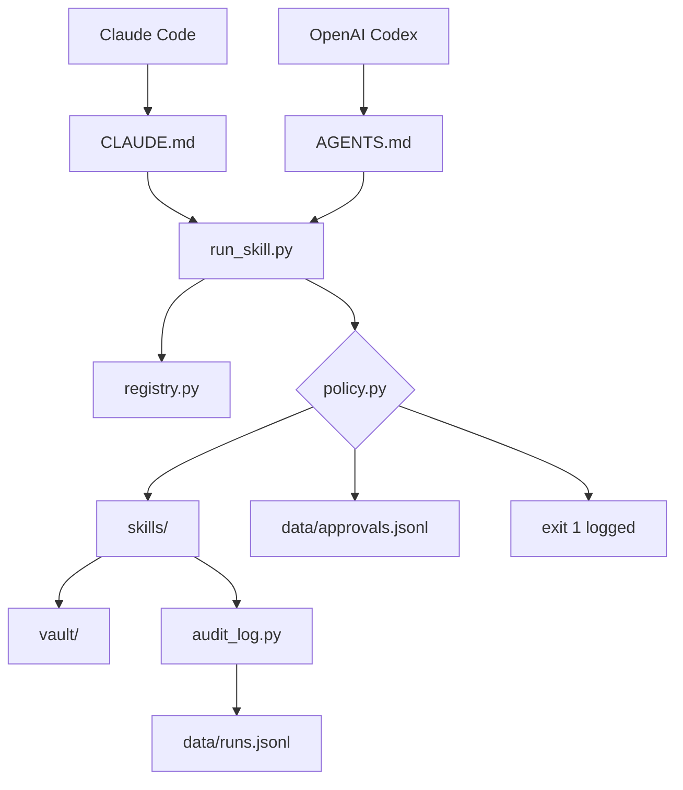

<p align="center">
  <picture>
    <source media="(prefers-color-scheme: dark)" srcset="https://raw.githubusercontent.com/nicholashidalgo/ai-health-coach/main/assets/nh-logo-dark.svg" width="80">
    <source media="(prefers-color-scheme: light)" srcset="https://raw.githubusercontent.com/nicholashidalgo/ai-health-coach/main/assets/nh-logo-light.svg" width="80">
    
  </picture>
</p>

<h1 align="center">agentic-os-control-plane</h1>
<p align="center"><b>Local-first governed execution layer for AI agents</b></p>

<p align="center">
  <a href="https://github.com/nicholashidalgo/agentic-os-control-plane"></a>&nbsp;
  <a href="https://github.com/nicholashidalgo/agentic-os-control-plane"></a>&nbsp;
  <a href="LICENSE"></a>&nbsp;
  <a href="https://github.com/nicholashidalgo/agentic-os-control-plane"></a>
</p>

<p align="center">
  
  
  
  
  
</p>

A working governed execution layer for AI agents. This project demonstrates how agentic AI systems can support workplace workflows while staying inside policy controls, human approval gates, output boundaries, and append-only audit logging.

The current implementation runs locally and provides shared infrastructure for Claude Code and OpenAI Codex through a common skill contract, Markdown memory vault, policy enforcement layer, approval workflow, and append-only audit log.

The goal is controlled automation: agents can perform useful work, but they do not operate without boundaries. Every action is evaluated, routed, logged, and constrained before it becomes part of a business workflow.

---

## Enterprise AI Platform Relevance

This project is designed as a vendor-neutral governance pattern for workplace AI agents. It is not tied to a single model provider or agent framework.

The same control-plane pattern can apply to agents built with:

| Platform | How this control plane applies |
|---|---|
| Microsoft Foundry / Azure AI | Adds policy, approval, audit, and evaluation controls around enterprise agent workflows |
| OpenAI Agents | Governs tool use, handoffs, SQL actions, document actions, and approval-required tasks |
| Amazon Bedrock Agents | Adds an enterprise control layer for agent actions, knowledge-base access, and workflow execution |
| Databricks AI/BI Genie | Supports governed natural-language analytics through approved definitions, query boundaries, and review paths |
| Local LLM / Model Context Protocol (MCP) tooling | Enables local-first workflow automation with controlled tool access and audit logging |

The model provider is not the core issue. The operating model around the agent is the issue: policy, approval, audit, evaluation, and business accountability.

---

## Workplace Production Relevance

This project addresses the practical enterprise question behind agentic AI deployment:

> How do we let AI agents help with real business work while preserving human oversight, policy compliance, auditability, and operational control?

The control plane answers five production questions:

1. What is the agent allowed to do?
2. Which actions require human approval?
3. Which actions should be denied outright?
4. How is every action logged for review?
5. How do we evaluate whether the agent is ready for broader use?

This pattern is relevant to corporate-function workflows such as finance operations, contract intake, document review, procurement support, HR knowledge retrieval, project status follow-up, executive reporting, internal knowledge automation, analytics request routing, and data operations.

---

## Enterprise Controls Demonstrated

| Control | What it does | Workplace relevance |
|---|---|---|
| Policy engine | Classifies actions as allowed, denied, or requiring approval | Prevents unmanaged agent behavior |
| Human approval workflow | Pauses sensitive actions until a person approves or denies them | Keeps humans in control of high-risk work |
| Skill registry | Defines approved agent capabilities | Prevents agents from using undefined or unapproved tools |
| Skill contracts | Documents purpose, inputs, outputs, and constraints | Makes agent behavior explicit and testable |
| Output validation | Blocks writes outside approved paths | Reduces risk of uncontrolled system changes |
| Secret detection | Checks for credential-like patterns | Reduces exposure of sensitive information |
| Append-only audit log | Records execution, outputs, status, and timestamps | Creates traceability for governance and review |
| Test suite | Validates policy, registry, runtime, and simulator behavior | Supports release discipline before broader use |

---

## What This Proves

This project demonstrates the operating discipline needed to move agentic AI from working prototype to trusted workplace system:

- Agent actions should be governed before execution
- Sensitive actions should require human approval
- Every execution should leave an audit trail
- Agent capabilities should be explicit, testable, and bounded
- Evaluation and policy controls should exist before broader rollout
- AI workflow design should account for risk, adoption, and operational trust
- Governance should be portable across model providers and AI platforms

---

## Architecture

The architecture separates agent intent from governed execution. Claude Code, OpenAI Codex, local models, or future enterprise agent platforms can request work, but actions flow through the same registry, policy, approval, and audit path before execution is considered valid.



### Policy decisions

| Decision | Meaning |
|---|---|
| Allow | Action proceeds to approved skills and tools |
| Require approval | Action pauses and routes to human review |
| Deny | Action is blocked and logged |

### Current local runtime

The current implementation runs locally and provides shared infrastructure for Claude Code and OpenAI Codex through a common skill contract, Markdown memory vault, policy enforcement layer, approval workflow, and append-only audit log.



---

## Getting Started


See [docs/getting-started.md](docs/getting-started.md) for the full walkthrough. Three commands get you running:

```bash
git clone https://github.com/nicholashidalgo/agentic-os-control-plane
cd agentic-os-control-plane
chmod +x install.sh && ./install.sh
```

`install.sh` creates the required vault and data directories, copies `config.example.yaml` to `config.yaml` on first run, and installs Python dependencies. It is safe to rerun.

**Approval workflow (v0.2):** when a skill hits a `REQUIRE_APPROVAL` policy gate, execution pauses and prints an `approval_id`:

```
  approval required: APR-20260505-a3f1c9
  action:  file_write → some/restricted/path
  reason:  path is outside permitted write prefixes
  expires: 2026-05-06T21:14:46+00:00

  to approve:  python control_plane/run_skill.py --approvals approve APR-20260505-a3f1c9
  to deny:     python control_plane/run_skill.py --approvals deny APR-20260505-a3f1c9
```

List pending approvals at any time:

```bash
python control_plane/run_skill.py --approvals list --status pending
```

---

## Configuration

Copy `config.example.yaml` to `config.yaml` (done automatically by `install.sh`) and edit as needed:

```yaml
vault_path: vault                              # where the memory vault lives
data_path: data                                # where audit logs are written
logs_path: logs                                # where runtime logs go
default_output_folder: vault/projects          # default skill output location
require_approval_for_destructive_actions: true # gate FILE_DELETE, GIT_COMMIT, etc.
allow_demo_skills: true                        # enable the bundled demo skills
```

All paths are relative to the repo root. `control_plane/config.py` loads `config.yaml`, falls back to `config.example.yaml`, and falls back further to safe built-in defaults — the repo never crashes on a missing config file.

---

## Skill System

Every skill lives in `skills/<name>/` and consists of two files: `SKILL.md` (the contract, read by agents before execution) and `run.py` (the implementation, which must define `run(input_str: str) -> list[str]` and return only paths under `vault/` or `data/`). Copy `skills/template/` to start a new skill.

| Skill | Description |
|-------|-------------|
| `morning_brief` | Reads `vault/daily/` logs and writes a dated morning brief |
| `vault_cleanup` | Promotes files with 2+ headings from `vault/raw/` to `vault/wiki/` |
| `research_digest` | Converts a raw note into a structured digest in `vault/wiki/` |
| `continuation_brief` | Writes a session handoff template to `vault/daily/` |
| `policy_simulator` | Runs a JSON action manifest through `policy.py` and writes a report |

See [docs/how-to-write-a-skill.md](docs/how-to-write-a-skill.md) for the full skill authoring guide.

---

## Roadmap

| Version | Status | Scope |
|---------|--------|-------|
| v0.1 — Local control plane | **Done** | 5 skills, policy engine, audit log, 41+ tests |
| v0.2 — Approval workflow | **In Progress** | Structured approval records, `--approvals` CLI, status lifecycle, rerun on approve |
| v0.3 — Dashboard | Planned | Local HTML dashboard from `runs.jsonl`, skill history, policy decisions |
| v0.4 — MCP / API integrations | Planned | External tools registered as governed skills, same policy and audit contract |

---

## Repo Structure

```
agentic-os-control-plane/
├── CLAUDE.md               # Operating rules for Claude Code
├── AGENTS.md               # Operating rules for OpenAI Codex CLI
├── pyproject.toml          # Python 3.12+ project config, pytest dev dep
│
├── control_plane/          # Core runtime — do not modify as an agent
│   ├── policy.py           # Action policy engine: ALLOW / REQUIRE_APPROVAL / DENY
│   ├── registry.py         # Skill catalog: name → path + metadata
│   ├── audit_log.py        # Append-only JSONL log writer
│   └── run_skill.py        # CLI entrypoint: intake → policy → exec → log
│
├── skills/                 # Self-contained executable units
│   ├── morning_brief/      # Summarises vault/daily/ logs into a morning brief
│   ├── vault_cleanup/      # Promotes structured raw/ notes to wiki/
│   ├── research_digest/    # Converts a raw note to a structured wiki digest
│   ├── continuation_brief/ # Writes a session handoff template to daily/
│   └── policy_simulator/   # Runs a JSON action manifest through policy.py
│
├── vault/                  # Agent memory store (Markdown, plain text)
│   ├── raw/                # Unstructured incoming notes
│   ├── wiki/               # Promoted, structured reference documents
│   ├── projects/           # Active project context and deliverables
│   └── daily/              # Session logs, briefs, continuation handoffs
│
├── data/                   # Structured audit data
│   ├── runs.jsonl          # Append-only skill execution log
│   └── approvals.jsonl     # Append-only approval request log
│
├── docs/                   # Technical documentation
│   ├── architecture.md     # Component map, execution flow, memory model
│   ├── security-model.md   # Policy matrix, write paths, secret detection
│   └── roadmap.md          # v0.1–v0.4 milestones
│
└── tests/                  # pytest suite (41 tests)
```

---

## Quick Start

```bash
git clone https://github.com/nicholashidalgo/agentic-os-control-plane
cd agentic-os-control-plane
pip install pytest
python -m pytest tests/ -v
```

**Run a skill:**

```bash
# Generate a morning brief from recent daily logs
python control_plane/run_skill.py --skill morning_brief

# Convert a raw note into a structured wiki digest
python control_plane/run_skill.py --skill research_digest --input vault/raw/sample_note.md

# Simulate policy decisions for a batch of proposed actions
python control_plane/run_skill.py --skill policy_simulator --input vault/raw/sample_action_manifest.json
```

**List all registered skills:**

```bash
python control_plane/run_skill.py --list
```

---

## Skill Contract

Every skill lives in `skills/<name>/` and consists of two files:

| File | Purpose |
|------|---------|
| `SKILL.md` | Human- and agent-readable contract: purpose, inputs, outputs, constraints |
| `run.py` | Implementation: a single `run(input_str: str) -> list[str]` function |

`run()` receives the `--input` string (empty string if no input required) and returns a list of output paths written, each relative to the repo root. All output paths must fall under `vault/` or `data/` — the control plane validates this before logging and will exit 1 on any violation.

**Registered skills:**

| Skill | Input | Description |
|-------|-------|-------------|
| `morning_brief` | none | Reads `vault/daily/` logs and writes a dated morning brief |
| `vault_cleanup` | none | Promotes files with 2+ headings from `vault/raw/` to `vault/wiki/` |
| `research_digest` | path to raw note | Converts a raw note into a structured digest in `vault/wiki/` |
| `continuation_brief` | optional session description | Writes a session handoff template to `vault/daily/` |
| `policy_simulator` | path to JSON action manifest | Runs each proposed action through `policy.py` and writes a report |

---

## Policy Layer

The policy layer checks and gates registered skill actions before and after execution. It is not a process-level sandbox. Skills run as Python functions in the same process.

| Action | Decision |
|--------|----------|
| `FILE_READ` | ALLOW |
| `FILE_WRITE` → `vault/` or `data/` | ALLOW |
| `FILE_WRITE` → `control_plane/`, `CLAUDE.md`, `AGENTS.md` | DENY |
| `FILE_WRITE` → any other path | REQUIRE APPROVAL |
| `FILE_DELETE` | REQUIRE APPROVAL |
| `GIT_COMMIT` | REQUIRE APPROVAL |
| `GIT_PUSH` | REQUIRE APPROVAL |
| `EMAIL_SEND` | REQUIRE APPROVAL |
| `API_WRITE` | REQUIRE APPROVAL |
| `SHELL_EXEC` | REQUIRE APPROVAL |

---

## Audit Log

Every skill execution is logged to `data/runs.jsonl`. Each record is a single JSON line:

```json
{
  "run_id": "RUN-20260505-211446",
  "skill": "research_digest",
  "inputs_hash": "16242b27ea85",
  "outputs": ["vault/wiki/digest_sample_note_2026-05-05.md"],
  "status": "success",
  "timestamp": "2026-05-05T21:14:46.764730+00:00"
}
```

Approval requests are logged separately to `data/approvals.jsonl` with `outcome: "pending"`. The `inputs_hash` is the first 12 characters of the SHA-256 of the input string — raw input is never stored. Content is checked for credential patterns before logging.

---

## Tests

```bash
python -m pytest tests/ -v
```

| File | Covers |
|------|--------|
| `tests/test_policy.py` | All `check_action()` decisions and `check_content_for_secrets()` patterns |
| `tests/test_registry.py` | Skill lookup, error messages, filesystem presence of `run.py` and `SKILL.md` |
| `tests/test_run_skill.py` | Output path validation: traversal blocking, absolute paths, out-of-bounds paths |
| `tests/test_policy_simulator.py` | Manifest evaluation, decision coverage, totals, unknown actions, missing input |

---

## Extending

### Add a skill

1. Create `skills/<name>/SKILL.md` — document purpose, inputs, outputs, and constraints
2. Create `skills/<name>/run.py` — implement `run(input_str: str) -> list[str]`; return only paths under `vault/` or `data/`
3. Add an entry to `SKILL_REGISTRY` in `control_plane/registry.py`
4. Add tests in `tests/test_<name>.py`

### Add a policy rule

Edit `control_plane/policy.py`:

- **Permit a new write path**: add a prefix to `ALLOWED_WRITE_PREFIXES`
- **Block a path unconditionally**: add a prefix to `BLOCKED_WRITE_PREFIXES`
- **Require approval for a new action type**: add the `ActionType` to `_REQUIRE_APPROVAL_ACTIONS`

---

## Author

<p align="center">
  <a href="https://linkedin.com/in/nicholashidalgo"></a>&nbsp;
  <a href="https://nicholashidalgo.com"></a>&nbsp;
  <a href="mailto:analytics@nicholashidalgo.com"></a>
</p>
