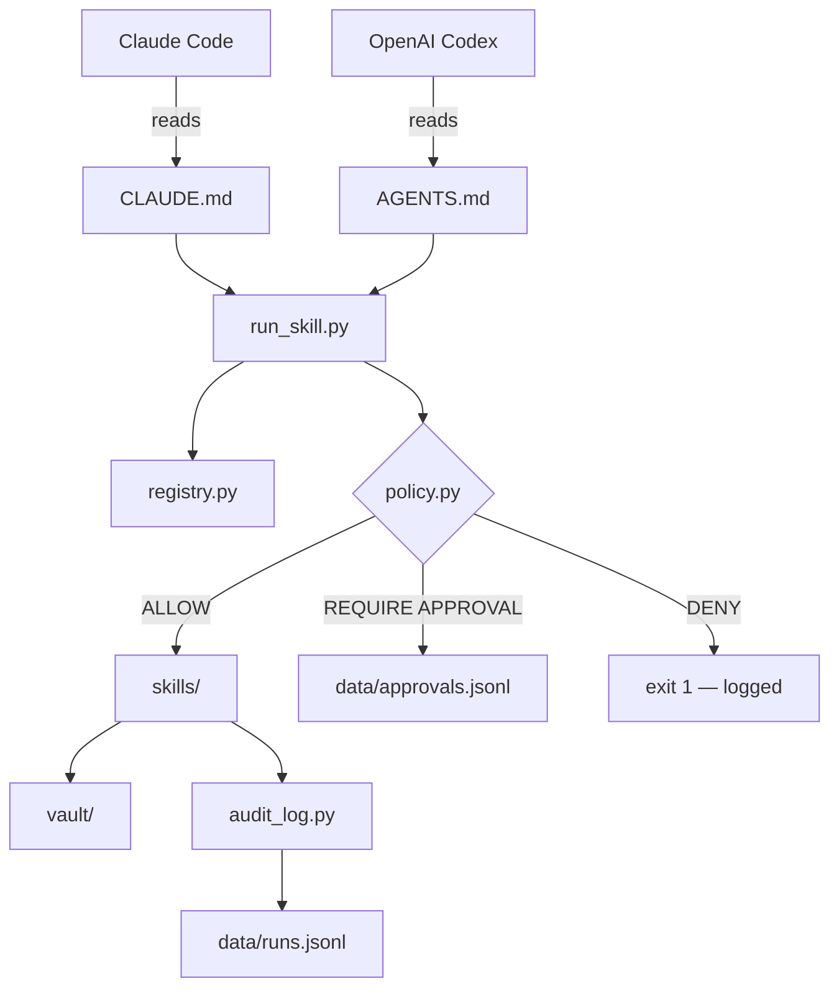

<p align="center">
  <picture>
    <source media="(prefers-color-scheme: dark)" srcset="https://raw.githubusercontent.com/nicholashidalgo/ai-health-coach/main/assets/nh-logo-dark.svg" width="80">
    <source media="(prefers-color-scheme: light)" srcset="https://raw.githubusercontent.com/nicholashidalgo/ai-health-coach/main/assets/nh-logo-light.svg" width="80">
    
  </picture>
</p>

<h1 align="center">agentic-os-control-plane</h1>
<p align="center"><b>Local-first governed execution layer for AI agents</b></p>

<p align="center">
  <a href="https://github.com/nicholashidalgo/agentic-os-control-plane"></a>&nbsp;
  <a href="https://github.com/nicholashidalgo/agentic-os-control-plane"></a>&nbsp;
  <a href="LICENSE"></a>&nbsp;
  <a href="https://github.com/nicholashidalgo/agentic-os-control-plane"></a>
</p>

<p align="center">
  
  
  
  
  
</p>

A local-first governed execution layer for AI agents. Provides shared infrastructure for Claude Code and OpenAI Codex: a common skill contract, Markdown memory vault, policy enforcement layer, and append-only audit log.

---

## Architecture



---

## Repo Structure

```
agentic-os-control-plane/
├── CLAUDE.md               # Operating rules for Claude Code
├── AGENTS.md               # Operating rules for OpenAI Codex CLI
├── pyproject.toml          # Python 3.12+ project config, pytest dev dep
│
├── control_plane/          # Core runtime — do not modify as an agent
│   ├── policy.py           # Action policy engine: ALLOW / REQUIRE_APPROVAL / DENY
│   ├── registry.py         # Skill catalog: name → path + metadata
│   ├── audit_log.py        # Append-only JSONL log writer
│   └── run_skill.py        # CLI entrypoint: intake → policy → exec → log
│
├── skills/                 # Self-contained executable units
│   ├── morning_brief/      # Summarises vault/daily/ logs into a morning brief
│   ├── vault_cleanup/      # Promotes structured raw/ notes to wiki/
│   ├── research_digest/    # Converts a raw note to a structured wiki digest
│   ├── continuation_brief/ # Writes a session handoff template to daily/
│   └── policy_simulator/   # Runs a JSON action manifest through policy.py
│
├── vault/                  # Agent memory store (Markdown, plain text)
│   ├── raw/                # Unstructured incoming notes
│   ├── wiki/               # Promoted, structured reference documents
│   ├── projects/           # Active project context and deliverables
│   └── daily/              # Session logs, briefs, continuation handoffs
│
├── data/                   # Structured audit data
│   ├── runs.jsonl          # Append-only skill execution log
│   └── approvals.jsonl     # Append-only approval request log
│
├── docs/                   # Technical documentation
│   ├── architecture.md     # Component map, execution flow, memory model
│   ├── security-model.md   # Policy matrix, write paths, secret detection
│   └── roadmap.md          # v0.1–v0.4 milestones
│
└── tests/                  # pytest suite (41 tests)
```

---

## Quick Start

```bash
git clone https://github.com/nicholashidalgo/agentic-os-control-plane
cd agentic-os-control-plane
pip install pytest
python -m pytest tests/ -v
```

**Run a skill:**

```bash
# Generate a morning brief from recent daily logs
python control_plane/run_skill.py --skill morning_brief

# Convert a raw note into a structured wiki digest
python control_plane/run_skill.py --skill research_digest --input vault/raw/sample_note.md

# Simulate policy decisions for a batch of proposed actions
python control_plane/run_skill.py --skill policy_simulator --input vault/raw/sample_action_manifest.json
```

**List all registered skills:**

```bash
python control_plane/run_skill.py --list
```

---

## Skill Contract

Every skill lives in `skills/<name>/` and consists of two files:

| File | Purpose |
|------|---------|
| `SKILL.md` | Human- and agent-readable contract: purpose, inputs, outputs, constraints |
| `run.py` | Implementation: a single `run(input_str: str) -> list[str]` function |

`run()` receives the `--input` string (empty string if no input required) and returns a list of output paths written, each relative to the repo root. All output paths must fall under `vault/` or `data/` — the control plane validates this before logging and will exit 1 on any violation.

**Registered skills:**

| Skill | Input | Description |
|-------|-------|-------------|
| `morning_brief` | none | Reads `vault/daily/` logs and writes a dated morning brief |
| `vault_cleanup` | none | Promotes files with 2+ headings from `vault/raw/` to `vault/wiki/` |
| `research_digest` | path to raw note | Converts a raw note into a structured digest in `vault/wiki/` |
| `continuation_brief` | optional session description | Writes a session handoff template to `vault/daily/` |
| `policy_simulator` | path to JSON action manifest | Runs each proposed action through `policy.py` and writes a report |

---

## Policy Layer

The policy layer checks and gates registered skill actions before and after execution. It is not a process-level sandbox. Skills run as Python functions in the same process.

| Action | Decision |
|--------|----------|
| `FILE_READ` | ALLOW |
| `FILE_WRITE` → `vault/` or `data/` | ALLOW |
| `FILE_WRITE` → `control_plane/`, `CLAUDE.md`, `AGENTS.md` | DENY |
| `FILE_WRITE` → any other path | REQUIRE APPROVAL |
| `FILE_DELETE` | REQUIRE APPROVAL |
| `GIT_COMMIT` | REQUIRE APPROVAL |
| `GIT_PUSH` | REQUIRE APPROVAL |
| `EMAIL_SEND` | REQUIRE APPROVAL |
| `API_WRITE` | REQUIRE APPROVAL |
| `SHELL_EXEC` | REQUIRE APPROVAL |

---

## Audit Log

Every skill execution is logged to `data/runs.jsonl`. Each record is a single JSON line:

```json
{
  "run_id": "RUN-20260505-211446",
  "skill": "research_digest",
  "inputs_hash": "16242b27ea85",
  "outputs": ["vault/wiki/digest_sample_note_2026-05-05.md"],
  "status": "success",
  "timestamp": "2026-05-05T21:14:46.764730+00:00"
}
```

Approval requests are logged separately to `data/approvals.jsonl` with `outcome: "pending"`. The `inputs_hash` is the first 12 characters of the SHA-256 of the input string — raw input is never stored. Content is checked for credential patterns before logging.

---

## Tests

```bash
python -m pytest tests/ -v
```

| File | Covers |
|------|--------|
| `tests/test_policy.py` | All `check_action()` decisions and `check_content_for_secrets()` patterns |
| `tests/test_registry.py` | Skill lookup, error messages, filesystem presence of `run.py` and `SKILL.md` |
| `tests/test_run_skill.py` | Output path validation: traversal blocking, absolute paths, out-of-bounds paths |
| `tests/test_policy_simulator.py` | Manifest evaluation, decision coverage, totals, unknown actions, missing input |

---

## Extending

### Add a skill

1. Create `skills/<name>/SKILL.md` — document purpose, inputs, outputs, and constraints
2. Create `skills/<name>/run.py` — implement `run(input_str: str) -> list[str]`; return only paths under `vault/` or `data/`
3. Add an entry to `SKILL_REGISTRY` in `control_plane/registry.py`
4. Add tests in `tests/test_<name>.py`

### Add a policy rule

Edit `control_plane/policy.py`:

- **Permit a new write path**: add a prefix to `ALLOWED_WRITE_PREFIXES`
- **Block a path unconditionally**: add a prefix to `BLOCKED_WRITE_PREFIXES`
- **Require approval for a new action type**: add the `ActionType` to `_REQUIRE_APPROVAL_ACTIONS`

---

## Author

<p align="center">
  <a href="https://linkedin.com/in/nicholashidalgo"></a>&nbsp;
  <a href="https://nicholashidalgo.com"></a>&nbsp;
  <a href="mailto:analytics@nicholashidalgo.com"></a>
</p>
